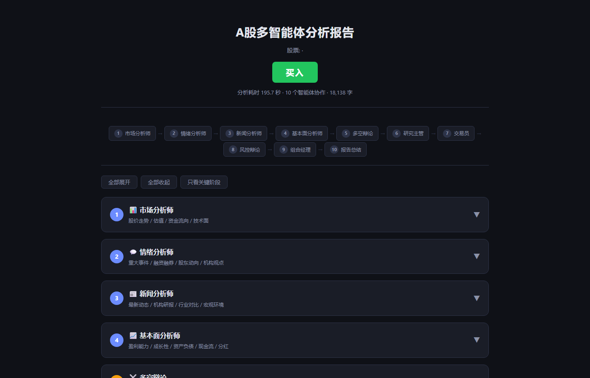

[English](README.en.md) | 中文

# A股智能决策系统


[](https://2033121.github.io/astock-trading-agents/)

基于 LangGraph 的多Agent辩论式量化交易决策框架，15位AI分析师协作，输出结构化投资评级与可视化分析报告。

> **风险提示**: 本工具仅供研究和辅助决策参考，不构成投资建议。投资有风险，入市需谨慎。

## 核心特性

- **多Agent辩论**: 15位专业角色(4位分析师 + 多空辩论 + 三方风控 + 研究/基金经理 + 交易员 + 信号/报告/记忆)
- **多源数据融合**: Tushare 财务数据 + akshare 行情数据 + 东方财富新闻数据，三级 fallback
- **记忆反思**: 历史决策记忆 + 延迟反思学习
- **可视化报告**: 自动生成可交互 HTML 分析报告，10 阶段流水线过程全透明
- **结构化输出**: Pydantic 模型保证输出格式，支持五级评级(买入/增持/持有/减持/卖出)
- **灵活LLM**: OpenAI兼容接口，支持 DeepSeek/Qwen/GLM/Ollama 等 9 种提供商
- **生产级容错**: Tenacity 指数退避重试（3次 4s→60s）+ 三态熔断器（5次失败→OPEN→30s冷却），保护所有 LLM 调用
- **四层模型分配**: Deep/Heavy/Standard/Quick 四级模型分层，按角色复杂度自动路由到最优模型
- **Token 优化套件** (v0.5): 共享系统提示词前缀缓存（DeepSeek KV 折扣 ~90%+）+ 研究员/基金经理双侧确定性上下文摘要（0 额外 token）+ 可选节点级语义响应缓存（TTL/LRU/近似匹配，默认关闭）
- **MCP Server** (v0.5): 零依赖 stdio 服务器，把完整分析管线、快照查询、决策记忆与回测复盘暴露给任意 MCP 主机（如 Claude Desktop）
- **智能上下文瘦身**: 按目标节点裁剪报告内容（PM 保留结论 ~60-70% 压缩），整体节省 ~25% Token 消耗
- **向量记忆**: 纯 Python TF-IDF bigram 语义检索，分析前注入历史上下文，分析后自动索引持久化
- **反思闭环**: 跟踪历史预测 → akshare 获取实际收益 → LLM 生成反思教训 → 写回记忆提升未来决策
- **辩论公平性保证** (v0.5): 多空辩论含最终反驳轮（双方各发言一次后再裁决），路由/接线护栏测试防止回归



## 架构

```
┌─────────────────────────────────────────────────────────────────┐
│                        START                                     │
└───────────────────────┬─────────────────────────────────────────┘
                        │
        ┌───────────────┼───────────────┬───────────────┐
        ▼               ▼               ▼               ▼
 ┌──────────────┐ ┌──────────────┐ ┌──────────────┐ ┌──────────────┐
 │  Market      │ │  Social      │ │  News        │ │  Fundamentals│
 │  Analyst     │ │  Analyst     │ │  Analyst     │ │  Analyst     │
 │  (技术面)    │ │  (舆情)      │ │  (新闻)      │ │  (基本面)    │
 └──────┬───────┘ └──────┬───────┘ └──────┬───────┘ └──────┬───────┘
        │                │                │                │
        │   [ReAct tool loop: 工具调用 → 数据获取 → 分析]  │
        │                │                │                │
        └────────────────┴────────┬───────┴────────────────┘
                                  ▼
                  ┌───────────────────────────────┐
                  │     Investment Debate          │
                  │   ┌─────────┐   ┌──────────┐  │
                  │   │  Bull   │◄─►│  Bear    │  │
                  │   │Researcher│   │Researcher│  │
                  │   │ (看多)  │   │ (看空)   │  │
                  │   └─────────┘   └──────────┘  │
                  └───────────────┬───────────────┘
                                  ▼
                  ┌───────────────────────────────┐
                  │     Research Manager           │
                  │   综合辩论 → 投资评级方案      │
                  └───────────────┬───────────────┘
                                  ▼
                  ┌───────────────────────────────┐
                  │         Trader                 │
                  │   投资方案 → 交易执行计划      │
                  └───────────────┬───────────────┘
                                  ▼
                  ┌───────────────────────────────┐
                  │     Risk Debate                │
                  │  ┌──────────┐  ┌──────────┐   │
                  │  │Aggressive│─►│Conservat.│   │
                  │  │ (激进)   │  │ (保守)   │   │
                  │  └──────────┘  └────┬─────┘   │
                  │                     ▼          │
                  │              ┌──────────┐      │
                  │              │ Neutral  │      │
                  │              │ (中性)   │      │
                  │              └──────────┘      │
                  └───────────────┬───────────────┘
                                  ▼
                  ┌───────────────────────────────┐
                  │     Portfolio Manager          │
                  │   风控讨论 → 最终投决评级      │
                  └───────────────┬───────────────┘
                                  ▼
                  ┌───────────────────────────────┐
                  │   Report Generator             │
                  │   生成可交互 HTML 分析报告     │
                  └───────────────┬───────────────┘
                                  ▼
                                END
```

**15位AI角色**:

| 角色 | 数量 | 职责 |
|------|------|------|
| 技术分析师 | 1 | 分析价格走势、技术指标、成交量 |
| 新闻舆情分析师 | 1 | 分析个股新闻、政策动态、全球市场联动 |
| 市场情绪分析师 | 1 | 分析大宗交易、资金流向、机构动向 |
| 基本面分析师 | 1 | 分析财报、估值、盈利能力 |
| 看多研究员 | 1 | 从看多角度论证投资理由 |
| 看空研究员 | 1 | 从看空角度提出风险与质疑 |
| 研究经理 | 1 | 综合多空辩论，输出结构化投资评级 |
| 交易员 | 1 | 制定具体交易计划（入场价/止损/仓位） |
| 激进风控分析师 | 1 | 从激进角度评估风险收益比 |
| 保守风控分析师 | 1 | 从保守角度强调风险控制 |
| 中性风控分析师 | 1 | 平衡双方观点给出中立评估 |
| 基金经理 | 1 | 综合风控讨论，做出最终投决 |
| 信号提取器 | 1 | 从决策文本中提取结构化评级 |
| 报告生成器 | 1 | 汇总各阶段产出，生成可交互 HTML 报告 |
| 记忆管理器 | 1 | 存储/检索/反思历史决策 |

## 快速开始

### 环境要求

- Python >= 3.10
- 网络连接（用于调用 LLM API 和获取行情数据）

### 安装

```bash
# 克隆仓库
git clone https://github.com/2033121/astock-trading-agents.git
cd astock-trading-agents

# 开发模式安装
pip install -e .
```

### 配置

#### 1. LLM API 密钥（必须）

```bash
# OpenAI
export OPENAI_API_KEY=sk-your-key-here

# 或 DeepSeek
export OPENAI_API_KEY=sk-your-deepseek-key
export OPENAI_BASE_URL=https://api.deepseek.com
```

支持的 LLM 提供商：

| 提供商 | `--provider` 值 | 默认 Base URL | 所需环境变量 |
|--------|-----------------|---------------|-------------|
| OpenAI | `openai` | `https://api.openai.com/v1` | `OPENAI_API_KEY` |
| DeepSeek | `deepseek` | `https://api.deepseek.com` | `OPENAI_API_KEY` |
| Qwen/DashScope | `qwen` | `https://dashscope.aliyuncs.com/compatible-mode/v1` | `DASHSCOPE_API_KEY` |
| GLM/智谱 | `glm` | `https://open.bigmodel.cn/api/paas/v4` | `OPENAI_API_KEY` |
| Ollama (本地) | `ollama` | `http://localhost:11434/v1` | 无需 |
| OpenRouter | `openrouter` | `https://openrouter.ai/api/v1` | `OPENAI_API_KEY` |
| SiliconFlow | `siliconflow` | `https://api.siliconflow.cn/v1` | `OPENAI_API_KEY` |
| Together | `together` | `https://api.together.xyz/v1` | `OPENAI_API_KEY` |
| Groq | `groq` | `https://api.groq.com/openai/v1` | `OPENAI_API_KEY` |

#### 2. 数据源 API（可选但推荐）

| 数据源 | 用途 | 环境变量 | 获取方式 |
|--------|------|---------|---------|
| Tushare Pro | 财务报表、资金流向、股东信息 | `TUSHARE_TOKEN` | [注册获取](https://tushare.pro/register) |
| 东方财富妙想 | 新闻资讯、实时行情 | `MX_APIKEY` | [妙想平台](https://mkapi2.dfcfs.com) |
| akshare | 行情数据、技术指标 | 无需 | 开源库，自动可用 |

系统内置了三级 fallback 机制：当首选数据源不可用时，自动切换到备选源。

#### 3. 报告输出目录（可选）

```bash
# 设置 HTML 报告保存目录
export ASTOCK_REPORT_DIR=/path/to/your/reports
```

未设置时，HTML 报告功能将自动禁用。

### 运行分析

```bash
# 基础用法 — 分析平安银行
astock-trader analyze 000001

# 指定日期和提供商
astock-trader analyze 600519 --date 2025-06-01 --provider deepseek

# 仅选择技术面和基本面分析
astock-trader analyze 300750 --analysts market,fundamentals

# 增加辩论轮数
astock-trader analyze 000001 --debate-rounds 2 --risk-rounds 2

# 指定深度思考模型
astock-trader analyze 600519 --deep-model deepseek-reasoner

# 安静模式（仅输出评级）
astock-trader analyze 000001 --quiet

# 输出到指定文件
astock-trader analyze 000001 --output result.json
```

### 查看历史

```bash
# 查看所有历史
astock-trader history

# 查看特定标的历史
astock-trader history 000001

# 限制条数
astock-trader history 600519 --limit 5
```

### 管理记忆

```bash
# 显示所有记忆条目
astock-trader memory show

# 列出 pending 状态的条目
astock-trader memory resolve

# 清除所有记忆（需确认）
astock-trader memory clear
```

### 配置管理

```bash
# 显示当前配置
astock-trader config --show

# 修改 LLM 提供商
astock-trader config --set llm_provider --value deepseek

# 修改深度思考模型
astock-trader config --set deep_think_llm --value deepseek-reasoner

# 修改快速思考模型
astock-trader config --set quick_think_llm --value deepseek-chat

# 启用检查点（崩溃恢复）
astock-trader config --set checkpoint_enabled --value true

# 重置为默认配置
astock-trader config --reset
```

## CLI 命令

| 命令 | 说明 | 示例 |
|------|------|------|
| `analyze <symbol>` | 运行多Agent分析流水线 | `astock-trader analyze 000001` |
| `history [symbol]` | 查看分析历史记录 | `astock-trader history 600519 --limit 5` |
| `memory <action>` | 管理决策记忆日志 | `astock-trader memory show` |
| `config` | 查看和修改配置 | `astock-trader config --show` |

### `analyze` 选项

| 选项 | 简写 | 说明 | 默认值 |
|------|------|------|--------|
| `--date` | `-d` | 交易日期 YYYY-MM-DD | 今天 |
| `--provider` | `-p` | LLM 提供商 | `openai` |
| `--deep-model` | | 深度思考模型名称 | `deepseek-chat` |
| `--quick-model` | | 快速思考模型名称 | `deepseek-chat` |
| `--base-url` | | 自定义 API Base URL | 按提供商自动选择 |
| `--language` | `-l` | 输出语言 | `Chinese` |
| `--analysts` | `-a` | 分析师组合（逗号分隔） | 全部四个 |
| `--debate-rounds` | | 多空辩论轮数 | `1` |
| `--risk-rounds` | | 风控讨论轮数 | `1` |
| `--checkpoint` | | 启用 SQLite 检查点 | `false` |
| `--output` | `-o` | 输出文件路径 | 自动生成 |
| `--quiet` | `-q` | 安静模式 | `false` |

### `memory` 操作

| 操作 | 说明 |
|------|------|
| `show` | 显示所有记忆条目 |
| `clear` | 清除记忆（需确认） |
| `resolve` | 列出所有 pending 条目 |

## Python API

```python
from astock_trader.graph import TradingAgentsGraph

# 创建分析图
graph = TradingAgentsGraph(
    selected_analysts=["market", "news", "fundamentals"],
    config={
        "llm_provider": "deepseek",
        "deep_think_llm": "deepseek-reasoner",
        "quick_think_llm": "deepseek-chat",
        "max_debate_rounds": 2,
        "max_risk_discuss_rounds": 1,
        "report_output_dir": "./reports",  # HTML 报告保存目录
    },
)

# 运行分析
final_state, rating = graph.propagate("000001", "2025-06-10")

print(f"评级: {rating}")
print(f"最终决策: {final_state.get('final_trade_decision', '')}")
print(f"HTML 报告: {final_state.get('report_path', '')}")
```

### Agent 工厂函数

```python
from astock_trader.agents import (
    create_market_analyst,
    create_bull_researcher,
    create_research_manager,
    create_trader,
    create_aggressive_debator,
)
from astock_trader.llm_clients import create_llm_client

# 创建 LLM
client = create_llm_client(provider="deepseek", model="deepseek-chat")
llm = client.get_llm()

# 创建各角色 Agent
market_node = create_market_analyst(llm)
bull_node = create_bull_researcher(llm)
manager_node = create_research_manager(llm, deep_think_llm=llm)

import functools

trader_node = functools.partial(create_trader(llm), company_name="贵州茅台")
```

### 记忆系统

```python
from astock_trader.agents.utils.memory import TradingMemoryLog

mem = TradingMemoryLog(memory_dir="~/.astock_trader")

# 存储决策
mem.store_decision(
    "000001",
    "2025-06-10",
    {
        "rating": "买入",
        "action": "买入",
        "reasoning": "技术面突破",
    },
)

# 获取历史上下文
context = mem.get_past_context("000001")

# 批量更新反思
mem.batch_update_with_outcomes(
    [
        {
            "ticker": "000001",
            "trade_date": "2025-06-10",
            "reflection": {"outcome": "盈利5%", "lesson": "技术分析有效"},
            "new_rating": "增持",
        },
    ]
)
```

## 智能体进度面板（侧边栏实时观察）

```bash
astock-trader analyze 600519 --provider deepseek     # 自动写 <…>_progress.jsonl（可关）
python3 scripts/agent_panel.py <results_dir>/600519_20260911_progress.jsonl
```

生成的 `agent_panel.html` 每 2 秒自刷新，按阶段显示 12 位智能体的 运行中/完成/失败、
耗时与最终评级。DSH 会话用 `sidebar_open` 打开即可实时观察；其他宿主在浏览器打开
（详见 `integrations/README.md`）。

## 多宿主插件（不止 Qoder）

`skills/` 一次性注册到多种 Agent 宿主（幂等安装器，沙箱实测）：

| 宿主 | 方式 | 目标 |
|------|------|------|
| DSH | 软链技能目录（SKILL.md frontmatter 识别） | `~/.dsh/skills/` |
| Claude Code | 软链技能目录 | `~/.claude/skills/` |
| zCode | 软链技能目录 | `~/.zcode/skills/` |
| Codex CLI | SKILL.md → `~/.codex/prompts/astock-<slug>.md` slash 命令 | `~/.codex/prompts/` |
| Qoder | 原生 `.qoder-plugin/`（保留） | 仓库内 |

```bash
./integrations/install.sh             # 自动探测并注册全部
./integrations/install.sh dsh codex --dry-run
```

细节见 `integrations/README.md`。任何以 `AGENTS.md` 为约定的宿主（Codex/zCode）
自带技能触发词表；DSH/Claude 装完重启即加载。

## MCP Server

仓库根目录提供**零依赖**的 MCP stdio 服务器（`mcp_server.py`），可在任意 MCP 主机
（Claude Desktop 等）中把本框架作为工具集调用：

| 工具 | 说明 |
|------|------|
| `analyze_stock` | 对一只A股运行完整 15-agent 管线，返回最终评级与摘要 |
| `list_snapshots` | 列出最近分析快照（含 T+1/T+5/T+10/T+20 追踪收益） |
| `get_snapshot` | 一只股票的最新快照 + 历史评级时间线 + 累计价格变化 |
| `read_recent_memories` | 读取最近的交易决策记忆（反思闭环结论） |
| `review_backtest` | 回测复盘：评级-实际行情对照、T+1/5/10/20 追踪与准确率统计 |

客户端配置示例（JSON）：

```json
{
  "mcpServers": {
    "astock-trading-agents": {
      "command": "python",
      "args": ["D:/Qoder/astock-trading-agents/mcp_server.py"]
    }
  }
}
```

环境变量：`ASTOCK_SNAPSHOT_LOG_PATH`（快照日志路径，默认 scripts/save_snapshot.py 内置路径）、
`ASTOCK_MEMORY_LOG_PATH`（决策记忆 markdown）、`ASTOCK_MCP_CLI_TIMEOUT`（analyze 工具超时秒数，默认 1200）。

## QoderWork 集成

本系统可作为 QoderWork 插件使用，在 QoderWork 中直接调用分析能力：

1. 将本项目安装到 QoderWork 环境中
2. 通过 QoderWork 的 Plugin 机制注册 `astock-trader` 命令
3. 在 QoderWork 对话中使用 `/智能分析 000001` 等命令触发分析

也可以通过 QoderWork 的定时任务（Cron）功能设置定期自动分析：

```
每天 15:30 分析自选股列表并生成报告
```

插件包含 5 个 Skill：

| Skill | 说明 |
|-------|------|
| 智能分析 | 运行多Agent分析流水线，输出五级投资评级 |
| 分析历史 | 查看历史分析记录和决策结果 |
| 决策记忆 | 管理决策记忆日志，支持结算和反思 |
| 交易配置 | 查看和修改 LLM 模型、数据源等配置参数 |
| 复盘深度分析 | 回测数据深度分析，生成 per-agent 校准反馈 (v0.4) |
| 龙虎榜解读 | 龙虎榜席位归因 → 资金信号摘要，可注入 news/sentiment 分析师 (v0.5) |
| 行业对比解读 | 相对估值横截面：行业中位 PE/PB、分位数定位、多业务板块对标 (v0.5) |

## v0.5 升级亮点

v0.5 围绕 **Token 优化 + 对外能力 + 公平性收口** 三条主线（详见 CHANGELOG 与 `docs/改进路线图.md`）：

| 改进 | 模块 | 效果 |
|------|------|------|
| 辩论最终反驳轮 | `graph/conditional_logic.py` | 结算阈值 2N+1，保证裁决前双方论点均获回应；修复"不满轮反转"缺陷 |
| 共享提示词前缀 | `agents/utils/prompt_prefix.py` | 全部 11 个 LLM 节点统一 `SYSTEM_PREFIX`，命中 provider 前缀缓存（DeepSeek 折扣 ~90%+） |
| 研究员确定性摘要 | `graph/context_slimmer.py` | 超长报告保留标题/列表/数值证据行、长段只留首句，压缩 ~30-50%（0 额外 token） |
| 基金经理决策矩阵 | `agents/managers/portfolio_manager.py` | 完整上下文前注入各信息源方向分布与关键数值行，快速定位分歧 |
| 语义响应缓存 | `llm_clients/semantic_cache.py` | 同股同日重复分析命中缓存（TTL 60min/LRU 256/阈值 0.92），默认关闭稳步启用 |
| 零依赖 MCP server | `mcp_server.py` | `analyze_stock`/`list_snapshots`/`get_snapshot`/`read_recent_memories`/`review_backtest` 5 工具 |
| 龙虎榜/行业对比 Skills | `skills/` | 资金信号注入 + 相对估值分位定位（接口均实机验证） |
| 英文 README | `README.en.md` | 国际读者精简版 + 五档评级中英对照 |
| 文档站 | `mkdocs.yml` + Pages 工作流 | mkdocs-material，`--strict` 构建零警告（需在 Settings 启用 Pages） |
| 质量体系 | `.github/workflows/` | ruff 0.16 全仓对齐 + CI 全绿；测试矩阵 151 → 241 项 |

## v0.4 升级亮点

v0.4 实现了完整的**反馈注入回路**——从回测跟踪到质量校验再到 prompt 注入，形成闭环：

| 改进 | 模块 | 效果 |
|------|------|------|
| 反馈消费模块 | `agents/utils/backtest_consumer.py` | 读取 `backtest_feedback.json`，质量门禁（≥10 快照）+ 10 节点条件注入 |
| 三级衰减 | `backtest_consumer.py` | fresh(<90d,1.0x) → warning(90-180d,0.5x) → expired(>180d,0x)，防止过时反馈误导 |
| past_context 修复 | `graph/setup.py` | 修复 Bear/Manager/PM/3风控 缺失注入，消除辩论信息不对称 |
| 追踪间隔修复 | `scripts/review_backtest.py` | T+N 改为交易日计数，修复周末/节假日导致的间隔偏差 |
| 快照置信度 | `scripts/save_snapshot.py` | 新增 `confidence` 数值字段（0.0–1.0），供反馈加权使用 |
| 记忆轮转 | `graph/trading_graph.py` | 自动调用 `_apply_rotation()`，防止记忆文件无限增长 |
| 复盘深度分析 Skill | `skills/复盘深度分析/` | Expert Suite Plugin，LLM 深度分析生成 per-agent 校准建议 |
| Cron 集成 | QoderWork | 每周五 17:00 自动运行回测+深度分析，结果推送微信 |

## v0.3 升级亮点

v0.3 基于 [webnovel-studio](https://github.com/2033121/webnovel-studio) v0.2 的生产工程经验横向迁移，6 项核心改进全部实施：

| 改进 | 模块 | 效果 |
|------|------|------|
| LLM 容错层 | `llm_clients/resilience.py` | 3 次指数退避重试 + 三态熔断器，API 故障时自动降级 |
| 四层模型分配 | `graph/setup.py` | Deep/Heavy/Standard/Quick 按角色智能路由，成本降低 40%+ |
| 反思闭环 | `graph/trading_graph.py` | T+5 实际收益回测 → LLM 反思 → 记忆更新，持续提升准确率 |
| 上下文瘦身 | `graph/context_slimmer.py` | 按节点裁剪报告，PM 压缩 60-70%，整体节省 ~25% Token |
| 向量记忆 | `memory/market_memory.py` | TF-IDF bigram 语义检索，突破"最近 N 次"上下文限制 |
| Headroom 集成 | `resilience.py` | Token 压缩层，长 prompt 场景节省 60-95% Token |
| 提示词前缀缓存 (v0.5) | `agents/utils/prompt_prefix.py` | 11 节点共享 `SYSTEM_PREFIX`，命中 provider KV 前缀缓存 |
| 语义响应缓存 (v0.5) | `llm_clients/semantic_cache.py` | 默认关闭；`enable_semantic_cache=True` 后同股同日重复分析直接命中 |
| 报告摘要双通道 (v0.5) | `context_slimmer.py` / `portfolio_manager.py` | 研究员确定性摘要 + PM 决策矩阵，0 额外 token |

所有配置项均可通过 `astock-trader config --set` 或 `default_config.py` 调整。 `astock-trader config --set` 或 `default_config.py` 调整。

## AI 编辑器适配

本项目为多种 AI 编程助手提供内置的项目级指令文件，帮助 AI 快速理解代码库结构和开发规范。

### Claude Code (`CLAUDE.md`)

项目根目录包含 `CLAUDE.md`，Claude Code 每次会话启动时自动读取。包含：

- 项目结构与模块说明
- 常用命令速查
- 编码规范与安全约束
- 环境变量清单

直接使用即可，无需额外配置。

### OpenAI Codex (`AGENTS.md`)

项目根目录包含 `AGENTS.md`，Codex CLI 每次启动时自动加载。采用 Codex 推荐的精简格式，包含：

- Commands / Structure / Stack / Style / Tests / Boundaries 六大板块
- 关键架构约束（空消息修复、报告生成回填机制等）

直接使用即可，无需额外配置。

### Trae IDE (`.trae/rules/`)

`.trae/rules/` 目录下包含项目规则文件，Trae 在编码时自动注入上下文：

| 文件 | 作用域 | 说明 |
|------|--------|------|
| `project_rules.md` | 全局 | 项目概览、架构、开发规范 |
| `agents_rules.md` | `src/astock_trader/agents/**/*.py` | 智能体模块开发规则 |
| `graph_rules.md` | `src/astock_trader/graph/**/*.py` | LangGraph 编排层开发规则 |

直接使用即可，Trae 会根据文件路径自动匹配对应规则。

## 测试

```bash
# 运行所有测试（共 241 个）
pytest tests/

# 详细输出
pytest tests/ -v

# 运行特定测试文件
pytest tests/test_schemas.py
pytest tests/test_conditional_logic.py
pytest tests/test_signal_processing.py
pytest tests/test_memory.py
pytest tests/test_dataflows.py
pytest tests/test_agents.py
pytest tests/test_prompt_prefix.py      # v0.5: 提示词前缀接线护栏
pytest tests/test_semantic_cache.py     # v0.5: 语义响应缓存
pytest tests/test_pm_matrix.py          # v0.5: 基金经理决策矩阵
pytest tests/test_context_digest.py     # v0.5: 研究员报告摘要
pytest tests/test_mcp_server.py         # v0.5: MCP server（含 stdio 端到端）
pytest tests/test_backtest_consumer.py   # v0.4: 反馈消费 + 衰减测试

# 带覆盖率报告
pytest tests/ --cov=astock_trader --cov-report=term-missing
```

## 项目结构

```
astock-trading-agents/
├── pyproject.toml                  # 项目配置与依赖
├── README.md                       # 本文件
├── README.en.md                    # 英文精简版 (v0.5)
├── mcp_server.py                   # 零依赖 MCP stdio 服务器 (v0.5)
├── mkdocs.yml                      # 文档站配置 (v0.5)
├── LICENSE                         # MIT 许可证
├── skills/                         # QoderWork 插件 Skills
│   ├── 智能分析/                   # 多Agent分析
│   ├── 分析历史/                   # 历史记录查看
│   ├── 决策记忆/                   # 记忆管理
│   ├── 交易配置/                   # 配置管理
│   ├── 复盘深度分析/               # 回测反馈深度分析 (v0.4)
│   ├── 快照跟踪对比/               # 多期快照跟踪对比
│   ├── 龙虎榜解读/                 # 龙虎榜席位归因资金信号 (akshare 实测接口)
│   └── 行业对比解读/               # 相对估值横截面（PE/PB 分位定位）
├── src/
│   └── astock_trader/
│       ├── __init__.py
│       ├── default_config.py       # 默认配置
│       ├── cli/                    # CLI 命令行接口
│       │   ├── __init__.py
│       │   └── main.py             # Typer CLI (analyze/history/memory/config)
│       ├── agents/                 # Agent 定义
│       │   ├── __init__.py         # 顶层导出
│       │   ├── schemas.py          # Pydantic 结构化输出模型
│       │   ├── analysts/           # 分析师 (4位)
│       │   │   ├── market_analyst.py
│       │   │   ├── news_analyst.py
│       │   │   ├── social_media_analyst.py
│       │   │   └── fundamentals_analyst.py
│       │   ├── researchers/        # 研究员 (看多/看空)
│       │   │   ├── bull_researcher.py
│       │   │   └── bear_researcher.py
│       │   ├── managers/           # 经理 (研究/组合)
│       │   │   ├── research_manager.py
│       │   │   └── portfolio_manager.py
│       │   ├── trader/             # 交易员
│       │   │   └── trader.py
│       │   ├── risk_mgmt/          # 风控分析师 (激进/保守/中性)
│       │   │   ├── aggressive_debator.py
│       │   │   ├── conservative_debator.py
│       │   │   └── neutral_debator.py
│       │   └── utils/              # Agent 工具与状态
│       │       ├── prompt_prefix.py # 共享系统提示词前缀 (v0.5)
│       │       ├── agent_states.py
│       │       ├── agent_utils.py
│       │       ├── core_stock_tools.py
│       │       ├── technical_indicators_tools.py
│       │       ├── fundamental_data_tools.py
│       │       ├── news_data_tools.py
│       │       ├── mx_data_tools.py        # 东方财富妙想数据工具
│       │       ├── tushare_data_tools.py   # Tushare 数据工具
│       │       ├── memory.py       # 交易记忆系统
│       │       ├── backtest_consumer.py  # 回测反馈消费 (v0.4)
│       │       ├── rating.py       # 评级解析器
│       │       └── structured.py   # 结构化输出工具
│       ├── dataflows/              # 数据层
│       │   ├── __init__.py
│       │   ├── config.py           # 全局配置
│       │   ├── interface.py        # Vendor 路由系统（三级 fallback）
│       │   ├── akshare_data.py     # akshare 数据源（行情/技术指标）
│       │   ├── tushare_data.py     # Tushare 数据源（财务/资金流向）
│       │   ├── mx_data.py          # 东方财富妙想数据源（新闻/实时）
│       │   └── eastmoney_news.py   # 东方财富新闻源
│       ├── graph/                  # LangGraph 编排层
│       │   ├── __init__.py
│       │   ├── setup.py            # 图构建与编译
│       │   ├── trading_graph.py    # 主编排器
│       │   ├── conditional_logic.py # 条件路由
│       │   ├── propagation.py      # 状态传播
│       │   ├── reflection.py       # 反思机制
│       │   ├── signal_processing.py # 信号提取
│       │   ├── report_generator.py # HTML 报告生成器
│       │   ├── context_slimmer.py  # 智能上下文瘦身
│       │   └── checkpointer.py     # SQLite 检查点
│       ├── llm_clients/            # LLM 客户端
│       │   ├── __init__.py
│       │   ├── base_client.py      # 基类
│       │   ├── openai_client.py    # OpenAI 兼容客户端
│       │   ├── factory.py          # 客户端工厂
│       │   ├── resilience.py       # LLM 容错层（重试 + 熔断 + Headroom）
│       │   └── semantic_cache.py   # 节点级语义响应缓存 (v0.5)
│       └── memory/                 # 向量记忆系统
│           ├── __init__.py
│           └── market_memory.py   # TF-IDF bigram 语义检索 + 持久化
└── tests/                          # 测试
    ├── conftest.py
    ├── test_schemas.py             # Pydantic 模型测试
    ├── test_conditional_logic.py   # 条件路由测试
    ├── test_signal_processing.py   # 信号提取测试
    ├── test_memory.py              # 记忆系统测试
    ├── test_dataflows.py           # 数据层路由测试
    ├── test_agents.py              # Agent 工厂测试
    └── test_backtest_consumer.py   # v0.4: 反馈消费 + 衰减测试
```

## 评级体系

系统输出五级投资评级：

| 评级 | 含义 | 建议操作 |
|------|------|----------|
| **买入** | 强烈看多，多维度共振 | 积极建仓 |
| **增持** | 偏多，有上行空间 | 逢低加仓 |
| **持有** | 中性，方向不明确 | 观望等待 |
| **减持** | 偏空，风险偏高 | 逐步减仓 |
| **卖出** | 强烈看空，破位信号 | 止损离场 |

## 致谢

本项目灵感来自 [TradingAgents](https://github.com/TauricResearch/TradingAgents) 框架，针对A股市场进行了全面适配和增强。

## License

MIT
